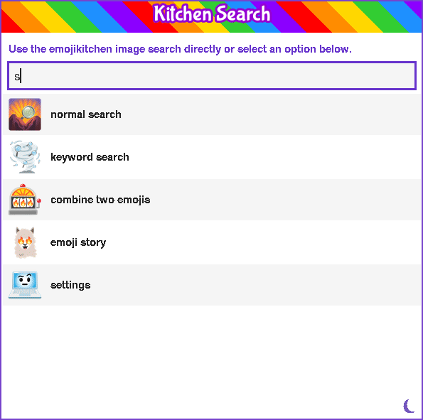
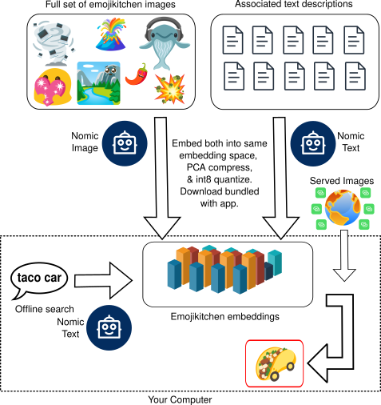

<p align="center"></p>

# Kitchen Search

A desktop app for searching [Google's Emoji Kitchen](https://emojipedia.org/emoji-kitchen) combo images. I use this app all the time when messaging friends from my laptop.

Emojikitchen has approximately 147,000 images. Many of them are *delightful*. 

I found the existing Emoji Kitchen options missing essential features like a proper search feature, especially when combining specific emojis. It's convenient to set a keyboard shortcut to launch it like `Alt+Shift+K`, search or browse for fun emojis, and copy them into your messaging app of choice.

## Usage

There are a few options on the main menu:

* Normal search: just type in the search box, and the search function will find the emojikitchen images closest to that search. Some fun examples: "ski chicken", "those were fun times", or even just "volcano".
* Combo search: this is for quickly finding two base emojis to combine. For example, "ballet" and "cow" gives you a dancing cow.
* Story: type or paste in a story to make an image illustrating that story. For example, "I love to see stories about my favorite emojis :)".
* Settings: customize your experience by choosing whether to have copy notifications, exit the app on copy, keybinding for the app (Windows only), etc.

Once you find an image, you can click on it or hit enter to copy it to the clipboard.

## Easy install (tested on Ubuntu, macOS and Windows)

<details>
<summary><b>macOS (Apple Silicon and Intel)</b></summary>

Install prerequisites — a Python with Tk, and [uv](https://github.com/astral-sh/uv):

```bash
brew install python-tk@3.12
curl -LsSf https://astral.sh/uv/install.sh | sh
```

Install KitchenSearch:

```bash
uv tool install --python "$(brew --prefix)/bin/python3.12" git+https://github.com/morganrivers/kitchensearch.git
```

Launch:

```bash
kitchensearch
```

### Setting a Keyboard Shortcut

To set a global hotkey on macOS, use Raycast, Alfred, or System Settings → Keyboard → Keyboard Shortcuts → Services to bind a key combo to the `kitchensearch` command.

</details>

<details>
<summary><b>Windows (10 or later)</b></summary>

* Go to the [releases](https://github.com/morganrivers/kitchensearch/releases) page
* Download `kitchensearch-windows-x86_64.exe`
* Run it and follow the installer

### Setting a Keyboard Shortcut

The installer sets `Alt+Shift+K` as the global hotkey automatically. A background daemon listens for it and opens the picker.

To change the hotkey: open the **Settings menu within the app** (or right-click the system tray icon → Settings), pick a new key combo, and save.

### Uninstall

**Windows:** uninstall via **Settings → Apps** (or **Control Panel → Programs**) as with any program.

</details>

<details>
<summary><b>Linux</b></summary>

Check your system is compatible (should print `x86_64`, then a non-empty `$DISPLAY` like `:0` (means X11 or XWayland is reachable), then glibc 2.15 or newer):
```bash
uname -m
echo "${DISPLAY:-NO DISPLAY}"
ldd --version | head -1
```

Manual install:
* Go to the [releases](https://github.com/morganrivers/kitchensearch/releases) page 
* Download `kitchensearch-linux-x86_64.tar.gz`
* Extract the ZIP file
* Run `kitchensearch`

Or, on the terminal (bash) just run:
```bash
wget https://github.com/morganrivers/kitchensearch/releases/download/v1.0.0/kitchensearch-linux-x86_64.tar.gz
tar -xzf kitchensearch-linux-x86_64.tar.gz
cd kitchensearch
./kitchensearch # launch the app
```

### Installing from source (tested on Ubuntu)

- Linux with X11 or Wayland (not sure which? run `echo $XDG_SESSION_TYPE`)
- **Python 3.10+**
- Tkinter (e.g. `sudo apt install python3-tk`)
```bash
git clone https://github.com/morganrivers/kitchensearch.git
sudo apt install python3-tk # install tkinter (python UI)
./scripts/install_from_source.sh # installs a venv and unzips app assets
.venv/bin/python3 kitchensearch.py # launch the app
```


#### Disk usage

The base install uses ~400 MB (scripts + embedding data + Python packages).

Thumbnail images are cached as you browse (~10 KB each) in `~/.cache/kitchensearch/thumbs/`. The cache grows gradually with use but is automatically pruned to stay under 200 MB. Copied emojis can always be rediscovered offline as well.

### Setting a Keyboard Shortcut

Launching the picker with a hotkey makes it instant to use from any app.

<details>
<summary><b>Linux — i3 / Sway</b></summary>

Add to your config (`~/.config/i3/config` or `~/.config/sway/config`), replacing the path with wherever you extracted the release:

```
bindsym alt+shift+k exec --no-startup-id ~/kitchensearch/kitchensearch
```

</details>

<details>
<summary><b>Linux — GNOME</b></summary>

1. Open **Settings → Keyboard → View and Customize Shortcuts → Custom Shortcuts**
2. Click **+**, set the name to `Kitchen Search`, and the command to the full path of the extracted binary (e.g. `/home/yourname/kitchensearch/kitchensearch`)
3. Assign your preferred key combo (e.g. `Alt+Shift+K`)

</details>

<details>
<summary><b>Linux — KDE Plasma</b></summary>

1. Open **System Settings → Shortcuts → Custom Shortcuts**
2. Click **Edit → New → Global Shortcut → Command/URL**
3. Set the command to the full path of the extracted binary (e.g. `/home/yourname/kitchensearch/kitchensearch`) and assign `Alt+Shift+K` as the trigger

</details>

### Uninstall

**Linux:** navigate to the folder where you unzipped kitchensearch and run:
```bash
rm -rf kitchensearch
rm -rf ~/.cache/kitchensearch
rm -rf ~/.config/kitchensearch
```

</details>

See **[docs/README.md](docs/README.md)** for clipboard setup and the full tool reference.

## How does it work?
### Search

I wanted to offer offline search so there's no data tracking or telemetry, your queries and embeddings never leave your machine. It's also cool to have tiny embedding models running locally. You should be aware there are HTTPS requests to Google's gstatic servers, but only for specific emoji requests, not for your search queries. 

The app uses the 22million parameter `all-MiniLM-L6-v2` which is a mini encoder-only transformer embedding model based on BERT (transformers are the most common language model architecture, also used for AI's like Claude). `Mini-LM` runs directly on your CPU, embedding search strings and doing cosine similarity between search queries and the pre-computed embeddings of image keywords packaged in the app. I decided this based on a tournament against Nomic image and text models, and CLIP image models, on the base set of emojis and associated descriptions, but `Mini-LM` was just as good without using image embeddings and much faster and smaller than other options. Given the limited variation relative to the full embedding space, a PCA compression doesn't hurt quality and allows the embeddings to compress to a combined 94mb. The result is a fast image search I was satisfied with.

I traveled a long way to arrive at MiniLM. At first I tried CLIP, but even the heavily quantized version was over 300mb. Then I tried jina-clip-v1, which at least lets text and image share an embedding space, so in theory you only need the text encoder at runtime. But that text encoder alone was 138mb (with a 344mb vision model needed at build time), and the 768-dim vectors made the embedding store huge in RAM. I tried Nomic next, but eventually realized the image embeddings weren't helping, as the keyword text packaged with each combo already captures the location of the image in embedding space at the resolution of these small models. So I dropped image embeddings entirely and landed on all-MiniLM-L6-v2, a 22M-parameter, English-only BERT-family encoder, about 90mb on disk, CPU-only. The embedding store was still big, but PCA on the full-precision vectors plus float16 quantization brings it down to about half the size, since the concepts used emoji descriptions only spans a small subspace of MiniLM's native dimensions. After some optimization, semantic search over the full ~147k combos takes about 250ms, which feels quite responsive. I also split shorter queries to construct combos directly out of the 618 base emojis (so "ballet cow" gives you a dancing cow), which keeps weird edge cases off the top of the list.

<p align="center"></p>


### Packaging
I used a few tricks to reduce the size of the embedded model. I used Nuitka and TKinter to save on space, and used a slightly slower numpy matrix multiplication leaving out the BLAS and MKL math libraries in numpy to save on RAM and disk storage. Still, Python had frustratingly heavy packaging for this project. 

### Rendering
A lot of work was required to get nice search results rendering, in particular fixing a nasty bug where 16 bit representation of the x11 canvas meant I had to pack rows to at maximum 200 search result sliding window on the canvas, so that I didn't exceed the 32k pixel height threshold. I also set up a doom scrolling feature where more emojis just load forever, instead of having to click a button once you reach the bottom. This really helped with latency issues and reduces total image downloads and the wait for search results to load. 

### Regression Testing
I used a lot of AI to speed up development. I found AI speeds things up, especially cross-platform support and debugging, but also breaks things more frequently. I vibe coded a visual regression testing interface to help me figure out when something had degraded with the app. I also had some fast tests that broke before I fixed the bugs, and work after I fixed them.
